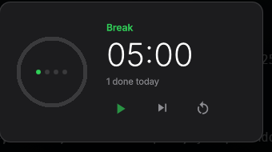

# Pomodoro for k4

**A focus timer that lives in the island.** The countdown rides in the pill
without taking any room, and the island opens by itself when a phase ends.

A pomodoro is a *live activity* — it starts, it runs, it finishes — which is
the one thing a Dynamic Island does that an ordinary bar cannot. That is the
whole argument for this plugin existing here rather than as a widget in a row.



## Install

From the bar: **Settings → Plugins → Discover**, once it is published.

From the terminal:

```sh
cd ~/.config/quickshell/k4
python3 tools/plugins.py --install https://github.com/k4ditano/k4-pomodoro --commit <sha>
quickshell ipc -p shell.qml call k4 pluginEnable pomodoro
```

It installs the exact commit you name, not the tip of a branch.

## What it does

- **In the pill**: the remaining time, tinted red while you work and green
  while you rest, with `❙❙` in front when it is paused. Click it to open.
- **In the island**: a ring that fills as the phase burns down, the clock, how
  many tomatoes you have done, and the four dots of the round. Three buttons:
  start/pause, skip, reset.
- **When a phase ends**: the island nudges, rings the desktop's own chime and
  opens to tell you — then closes on its own if you ignore it. Four tomatoes
  earn the long break.

## Settings

Under **Settings → Pomodoro**: focus length (15/25/50), short break (3/5/10),
long break (10/15/30), whether phases chain on their own, and whether it
rings.

Changing a length while a phase is *running* does not move the goal — a
pomodoro whose finish line moves is not a pomodoro. It applies to the next
one.

## Shortcut and IPC

The shortcut is `k4:pomodoro` — bind it in your Hyprland config; it starts,
pauses and resumes.

```sh
qs=~/.config/quickshell/k4/shell.qml
quickshell ipc -p $qs call k4.pomodoro empezar
quickshell ipc -p $qs call k4.pomodoro pausar
quickshell ipc -p $qs call k4.pomodoro saltar
quickshell ipc -p $qs call k4.pomodoro parar
quickshell ipc -p $qs call k4.pomodoro estado    # JSON, for scripts and bars
```

## Two decisions worth knowing

**The time is not counted by adding ticks.** It stores *when* the phase ends
and subtracts from the clock. Counting `remaining -= 1` every second
accumulates the error of every late tick, and worse: timers stop while the
machine sleeps, so closing the lid for twenty minutes would hand you back
twenty minutes of work that had already passed. With an end instant, suspend
fools nobody — and a bar restart mid-pomodoro does not cost you the pomodoro
either, because the instant is saved.

**The pill only repaints when someone can see it.** In Qt Quick an animation
or an update does not stop because nobody is looking, and refreshing a text
once a second for an empty screen repaints the whole scene once a second for
an empty screen. The indicator asks `K4.Isla.aLaVista` first, and paints in
full the moment the bar comes back.

## Permissions

`sonido`, and nothing else — it plays the desktop's chime when a phase ends.
No processes, no network, no files, no clipboard. Turn the ring off in
Settings and it makes no noise, but the permission stays declared, because
what a plugin declares is what it *can* do, not what it happens to do today.

## Requirements

k4 `>= 1.1.0`. Nothing else: no daemon, no extra package.

MIT.
